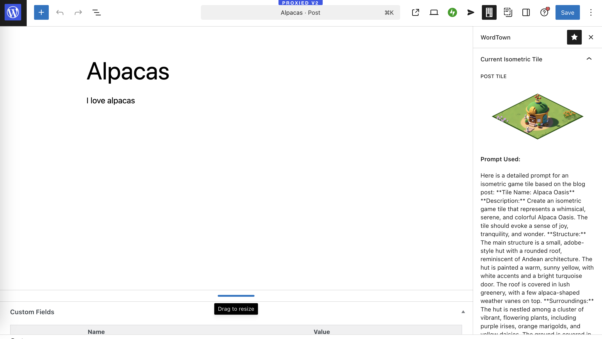

# Build your WordTown by posting on your blog

WordTown is a WordPress plugin that generates an isometric world of your posts.
For each post you publish, it will generate a tile. Your WordTown will be accessible under https://yourdomain.com/wordtown/. Each tile links to the original post.


New tiles will be generated via a WP-Cron job kicked off on post publish.
Alternatively, you can trigger tile generation manually from the sidebar in WP-Admin:



## How does it work?

You will need Replicate API key to generate tiles, as it is using Flux inpainting to generate the tiles.

## How to install

1. Grab latest release from [releases page](https://github.com/artpi/wordtown/releases/latest)
2. Download the wordtown.zip file
3. Upload to your WordPress
4. Configure the Replicate API key and other settings in `/wp-admin/options-general.php?page=wordtown-settings`
5. Now you can trigger the job on your posts manually

### What happens when I publish a post?

1. A WP-Cron job is triggered to generate a tile.
2. The post content, categories and title are sent to llama-3-70b to generate an image descripiton. You can customize the system prompt to change your desired style.
3. That descripiton, along with the [mask file](./assets/mask.png) and [reference image](./assets/tiletree.png) are sent to [Flux inpainting model](https://replicate.com/zsxkib/flux-dev-inpainting) to generate a tile.
4. A job gets scheduled to check up on the generation result in 30 seconds
5. Once result is ready, it is saved as an attachment to the post in your media library
6. The image in the media library is now cropped using the same mask to introduce transparency. This requires either ImageMagick or GD library to be installed on your server. Works on WordPress.com.
7. This tile is now exposed via API to be accessible in /wordtown page.

## Development

For fully functioning dev environent, your docker needs `imagemagic` with png suport. This is not available in the wp-env docker image so you need to install it.

```
npm run wp-env run cli /bin/bash
sudo apk add --no-cache imagemagick imagemagick-dev libpng-dev
```

## Future Improvements

- Portals to other sites via trackbacks would be nice. When site links to my post and it has WordTown enabled, we could introduce a waysign to redirect to that site.
- Smarter tile positioning
- Background needs to be better
- Edges are still not seamless, would be nice to work on that.
- I am thinking in front isometric perspective
- Could we introduce a character to walk around the town?
